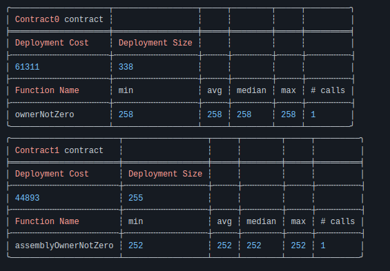

# Use assembly to check address(0)

```solidity
contract GasTest is DSTest {
    Contract0 c0;
    Contract1 c1;

    function setUp() public {
        c0 = new Contract0();
        c1 = new Contract1();
    }

    function testGas() public view {
        c0.ownerNotZero(address(this));
        c1.assemblyOwnerNotZero(address(this));
    }
}

contract Contract0 {
    function ownerNotZero(address _addr) public pure {
        require(_addr != address(0), "zero address)");
    }
}

contract Contract1 {
    function assemblyOwnerNotZero(address _addr) public pure {
        assembly {
            if iszero(_addr) {
                mstore(0x00, "zero address")
                revert(0x00, 0x20)
            }
        }
    }
}

```


